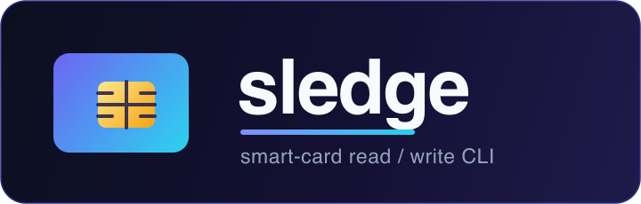

<p align="center">
  
</p>

A small Rust CLI that hammers on smart cards — inspect, read, and write **ACS
memory cards**, **ACOS smart cards**, and **contactless NFC tags** through a
PC/SC reader (built and tested with the **ACS ACR39U** and **ACR122U**). It
detects the card from its ATR and speaks the right protocol for each: the
ACR39U memory-card pseudo-APDUs for synchronous SLE cards, ISO 7816 for ACOS,
and NDEF over the contactless pseudo-APDUs for NFC tags.

> **Card support at a glance:** SLE memory cards, ACOS3 cards, and NFC tags
> (NTAG21x / MIFARE Ultralight and MIFARE Classic) are all supported for
> **read and write**. ACOS3 writes to a protected file need the card's code
> submitted first (`--pin`); without it the write is rejected with `69 82`.

```console
$ sledge detect
Reader: ACS ACR39U ICC Reader
ATR: 3B0492231091

Card: SLE (SLE5528 memory card, 1024 bytes)
```

## Features

- **Automatic card detection** — identifies the card from its ATR and reports
  whether it is an **SLE** memory card, an **ACOS** processor card, or a
  contactless **NFC** tag (and which tag family).
- **Read** — dump card memory as decoded text or a raw hex view, with
  `--offset` / `--length` control; NFC tags decode to their NDEF URI records.
- **Write** — write text into the card, with `0xFF` padding, read-back
  verification, and a dry-run mode by default. On NFC, the text is written as
  an NDEF message any phone can read.
- **NFC tags** — NTAG21x / MIFARE Ultralight (NFC Forum Type 2) and MIFARE
  Classic, with per-sector key exchange and one-time NDEF formatting for blank
  Classic tags.
- **Clear** — erase a card back to its blank state (`0xFF` on SLE, zeroed
  records on ACOS, an empty NDEF message on NFC), with the same dry-run and
  read-back verification as `write`.
- **Full inspect** — ATR, card type, presentation-error-counter state, and a
  complete hex dump saved to `sle5528.bin` (or `nfc-tag.bin` for a tag).
- **Memory-card aware connection** — transparently connects synchronous memory
  cards over the RAW protocol (they cannot negotiate T=0/T=1) and processor
  cards over T=0/T=1.
- **Transient-error recovery** — automatically recovers from
  `SCARD_W_RESET_CARD`, the card reset macOS raises on the first APDU of a
  shared session.
- **Safety-first writes** — the security code must be supplied explicitly, the
  error counter is checked before writing, and the tool refuses to write to a
  locked card. It never submits a PIN automatically.

## Supported cards

| Card | Kind | Capacity | Status |
|------|------|----------|--------|
| Infineon **SLE5528** (SLE4428-compatible) | Synchronous memory | 1024 bytes | Read + write, tested |
| ACS **ACOS3 / ACOS3-32** | Microprocessor (record files) | 32 KB | Read + write tested (write needs card code) |
| **NTAG213 / 215 / 216**, MIFARE Ultralight | Contactless, NFC Forum Type 2 | 144 / 504 / 888 bytes | Read + write (NDEF) |
| **MIFARE Classic** 1K / 4K / Mini / Plus | Contactless, 16-byte blocks | 720 / 1488 / 192 bytes of NDEF | Read + write (NDEF, AN1305 mapping) |

Other SLE44xx/55xx memory cards use the same command family and may work with
adjusted ATR constants. A contactless tag whose reader-synthesised ATR is not
one of the names above is treated as Type 2, which is what an unbranded NTAG
clone almost always is.

## Requirements

- Rust (edition 2024) and Cargo.
- A PC/SC reader: the ACS ACR39U for contact cards, the ACR122U (or any
  CCID reader that exposes the contactless pseudo-APDUs) for NFC tags.
- A working PC/SC stack:
  - **Linux** — `pcscd` plus a CCID driver with ACS memory-card support
    (`libacsccid` / distribution `libacsccid1`).
  - **macOS** — see the driver note below. **This matters** for memory cards.

### macOS driver note (important for SLE cards)

Apple's bundled CCID driver enumerates the ACR39U and reads its ATR, but it
**cannot transmit** the memory-card pseudo-APDUs — every write/read of an SLE
card fails with `NotTransacted`, even though `pcsc_scan` "sees" the card. The
generic upstream CCID driver is worse: it cannot even power on the memory card.

The fix is ACS's own open-source CCID driver, **[acsccid]**, which carries the
ACR39U card-power-on and memory-card fixes. Build and install it into the
macOS override directory so it takes precedence over Apple's:

```bash
# deps
brew install automake libtool gettext pkg-config libusb

# build acsccid (see acsccid INSTALL for the macOS static-libusb setup)
./MacOSX/configure && make

# install into the override path and restart the smartcard stack
sudo make install    # -> /usr/local/libexec/SmartCardServices/drivers/
sudo killall -9 com.apple.ifdreader usbsmartcardreaderd
# then unplug and replug the reader
```

If a memory-card command returns `NotTransacted`, this driver is not active.

[acsccid]: https://github.com/acshk/acsccid

## Installation

```bash
git clone https://github.com/tsirysndr/sledge.git
cd sledge
cargo build --release
# binary at target/release/sledge
```

## Usage

```
sledge [--reader <INDEX>] <COMMAND>

Commands:
  readers   List connected PC/SC readers with their indices
  detect    Print only the detected card type (SLE, ACOS or NFC) and its ATR
  inspect   Detect the card and print full info, dumping memory to a file
  read      Read text from the card
  write     Write text to the card
  clear     Erase the card's data back to its blank state

Options:
  --reader <INDEX>   0-based index into the PC/SC reader list [default: 0]
```

### Detect

```bash
sledge detect
```

### Inspect

Prints the ATR, card type, error-counter state, and a full hex dump, and saves
the raw memory to `sle5528.bin`. On an NFC tag it prints the UID, tag family,
usable memory, lock/format state and NDEF records, and saves `nfc-tag.bin`:

```bash
sledge inspect
```

### Read

```bash
# SLE — decoded as text (trailing 0xFF / 0x00 padding trimmed)
sledge read --offset 64 --length 16

# SLE — raw hex view
sledge read --offset 0 --length 32 --raw

# ACOS — read a record-based file (auto-detects record length, reads all records)
sledge read --file FF00 --raw          # manufacturer file
sledge read --file FF04                 # a user data file, as text
sledge read --file FF04 --record 2      # start from record 2
```

| Flag | Meaning |
|------|---------|
| `--offset <N>` | (SLE) Start byte (default `0`) |
| `--length <N>` | Max bytes to read (default: whole file) |
| `--raw` | Hex dump instead of decoded text |
| `--file <HEX>` | (ACOS) file ID to `SELECT` (default `FF04`, the user data file) |
| `--record <N>` | (ACOS) record number to start from (default `0`) |
| `--pin <STR>` | (ACOS) code to submit before reading a protected file (ASCII) |
| `--code <N>` | (ACOS) code reference for `--pin` (default `7` = Issuer Code) |

On an NFC tag, `read` prints the tag UID and then each NDEF URI record in tag
order; the offset/length/file flags do not apply. `--raw` hex-dumps the tag's
user memory instead:

```bash
sledge --reader ACR122U read          # the tag's URI records
sledge --reader ACR122U read --raw    # the tag's user memory
```

### Write

Writes are a **dry run** unless you pass `--yes`:

```bash
# SLE — dry run, then real write (presents the PSC, verifies by read-back)
sledge write "hello card" --offset 64 --psc FFFF
sledge write "hello card" --offset 64 --psc FFFF --yes

# ACOS — write records into a file, submitting the card's code first.
# ACOSTEST is the ACOS3 factory-default Issuer Code (code slot 7).
sledge write "sledge" --file FF04 --record 3 --pin ACOSTEST --yes

# NFC — one URI record per line, the first being the one a reader acts on
sledge write "https://example.com" --yes
sledge write "$(printf 'at://did:plc:xyz/app.rocksky.album/3k\nrocksky://library/album/42')" --yes

# NFC — a blank MIFARE Classic tag needs formatting once (it is blank, so
# nothing is lost); a phone does the same thing silently
sledge write "https://example.com" --format --yes
```

| Flag | Meaning |
|------|---------|
| `--psc <HEX>` | (SLE) security code, e.g. `FFFF`. **Required** to unlock SLE writes |
| `--offset <N>` | (SLE) start byte (default `32`, past the protected header) |
| `--length <N>` | Pad the written data (SLE: to N bytes with `0xFF`) |
| `--file <HEX>` | (ACOS) file ID to `SELECT` (default `FF04`, the user data file) |
| `--record <N>` | (ACOS) record number to start writing at (default `0`) |
| `--pin <STR>` | (ACOS) code to submit before writing (ASCII) |
| `--code <N>` | (ACOS) code reference for `--pin` (SUBMIT CODE P1; default `7` = Issuer Code, `0-6` = PIN / application codes) |
| `--format` | (NFC) NDEF-format a blank MIFARE Classic tag before writing |
| `--yes` | Actually perform the write (otherwise dry run) |

For ACOS, records have a fixed length that `sledge` auto-detects; the text is
split across records and the final record is padded with `0x00`. By default a
text write **owns the file** — records after the text are cleared to `0x00`, so
a plain `write "hello world"` leaves the file reading exactly `hello world` with
no stale data behind. Pass `--length N` to instead write exactly `N` bytes and
leave the remaining records untouched (useful with `--record` to update a single
record). Writing to a protected file without the correct `--pin` fails with
`69 82`.

#### NFC tags

An NFC tag is meant to be readable by anything that taps it, so `write` stores
the text as an **NDEF message** rather than the compact `at://` encoding the
contact cards use. Each newline-separated line becomes one NDEF URI record, in
order: a reader tries them front to back, so the first line is the one that
acts and the rest are fallbacks. Known schemes (`https://`, `tel:`, …) are
abbreviated per the NFC Forum URI RTD; `at://` and `rocksky://` are stored
whole. The message is written back-to-front — the page holding the TLV header
goes last — so a tag pulled off the reader mid-write reads as blank rather than
as a corrupt half-record, and the write is verified by reading it back.

MIFARE Classic stores the same message in 16-byte blocks behind a per-sector
key exchange (NXP AN1305). A tag straight out of the packet has no NDEF mapping
at all, and `--format` writes one — only ever on a tag still answering to the
factory key, and the sector trailers stay rewritable, so it is reversible.
A Classic tag locked with third-party keys is refused. A Type 2 tag whose
capability container says read-only (or whose lock bits are burned) is refused
too: that lock is irreversible.

### Clear

Erases the card back to its blank state. Like `write`, it is a **dry run**
unless you pass `--yes`, and it verifies by reading the region back. "Blank"
means whatever a factory card of that family reads back as:

| Card | Erased to | Default extent |
|------|-----------|----------------|
| SLE | `0xFF` | the 256-byte write span from `--offset` |
| ACOS | `0x00` records | `--record` to the end of the file |
| NFC | an empty NDEF message, user memory zeroed | the whole tag |

```bash
# SLE — needs the PSC, same as a write
sledge clear --psc FFFF --yes

# ACOS — wipe a file, or just part of it
sledge clear --file FF04 --pin ACOSTEST --yes
sledge clear --file FF04 --record 3 --length 32 --pin ACOSTEST --yes

# NFC — leaves an empty (but still formatted) tag
sledge --reader ACR122U clear --yes
```

| Flag | Meaning |
|------|---------|
| `--psc <HEX>` | (SLE) security code. **Required** to unlock the erase |
| `--offset <N>` | (SLE) start byte (default `32`) |
| `--length <N>` | Bytes to clear (SLE: default the write span; ACOS: default to end of file). Ignored for NFC |
| `--file <HEX>` | (ACOS) file ID to `SELECT` (default `FF04`) |
| `--record <N>` | (ACOS) record to start clearing at (default `0`) |
| `--pin <STR>` | (ACOS) code to submit first (ASCII) |
| `--code <N>` | (ACOS) code reference for `--pin` (default `7`) |
| `--yes` | Actually perform the erase (otherwise dry run) |

An NFC tag is erased to an **empty NDEF message** rather than to all-zeroes: a
tag wiped to zeroes has no NDEF mapping left and a phone reports it as
unformatted, where an empty message reads as the blank-but-writable tag you
asked for. The memory behind the message is zeroed all the same, so nothing of
the old records survives past the new terminator. A factory-blank MIFARE
Classic tag has no mapping to erase, so it is left alone rather than formatted.

#### ⚠️ The security code (PSC)

SLE memory is write-protected until you present the correct 2-byte security
code. **A wrong code decrements the card's error counter**, and once it reaches
`00` the card is **permanently write-locked** (reads still work). Only pass a
PSC you know is correct — the common factory default is `FFFF`, but a
personalized card will differ.

The `PRESENT_CODE` command answers `90 <EC>`, where `EC` is the error counter
after the attempt: `FF` means the code was accepted (and the counter is
restored); a lower value means it was wrong. `sledge` checks this, prints
the counter, and refuses to write when the card is locked.

Do not write at offset `0`: the first ~27 bytes hold the ATR / protected /
manufacturer area. The user zone starts higher up, which is why the write
default is offset `32`.

## Working with ACOS3 cards

ACOS3 is a microprocessor card with a small **file system**. Unlike the flat
SLE memory, you address a **file** (by ID) made of fixed-length **records**, so
ACOS commands use `--file` and `--record` instead of `--offset`. `sledge`
auto-detects each file's record length, reads/writes whole records, and runs
the whole sequence inside a PC/SC transaction (required on macOS — otherwise the
OS resets the card between APDUs).

Typical files on a factory/test ACOS3 (IDs are hex; yours may differ):

| File | Access | Notes |
|------|--------|-------|
| `FF00` | free read | Card identification (`ACOS`, version) |
| `FF02` | free read | Personalization File — its bytes feed the ATR historical bytes |
| `FF04` | free read, **write needs a code** | A user data file (records) |

Read is straightforward — select the file and it reads every record:

```bash
sledge read --file FF00 --raw          # hex dump of a system file
sledge read --file FF04                 # user file, decoded as text
sledge read --file FF04 --record 2      # start from a given record
```

Writing a **protected** file needs a code submitted first, via `--pin` (the code
value, ASCII) and `--code` (the code reference: `7` = Issuer Code, `0-6` = PIN /
application codes). ACOS3's factory-default Issuer Code is **`ACOSTEST`**:

```bash
# dry run — shows the plan, submits nothing
sledge write "sledge" --file FF04 --record 3 --pin ACOSTEST

# real write — submits the code (SUBMIT CODE 80 20 07 00 ...), writes, verifies
sledge write "sledge" --file FF04 --record 3 --pin ACOSTEST --yes
```

By default the text write clears any records after the text to `0x00`, so the
file reads back exactly what you wrote. Use `--length N` (optionally with
`--record`) to update just part of a file and leave the other records as they
are — e.g. `--record 1 --length 7` rewrites only record 1.

### Storing AT-URIs (`at://`)

`sledge` auto-detects `at://` URIs and stores them in a compact, lossless form,
then reconstructs them on read — you don't do anything special, just write/read
the URI. It applies three reversible tricks:

- **`did:plc` packing** — the 24 base32 characters of a `did:plc` identifier are
  packed back into their 15 raw bytes. Other authorities (`did:web:…`, handles)
  are stored literally, so they still round-trip (they just take more space).
- **Collection dictionary** — known collection NSIDs become a 1-byte index.
  Currently: `app.rocksky.playlist`, `app.rocksky.album`, `app.rocksky.artist`.
  An **unknown collection is rejected** with an error rather than stored, so a
  URI never silently ends up in a form that won't fit.
- **TID packing** — a record key that is a TID (13 base32-sortable chars) packs
  into 8 bytes; other record keys are stored literally.

With all three, a full Rocksky URI fits `FF04` (28 bytes):

```bash
sledge write "at://did:plc:7vdlgi2bflelz7mmuxoqjfcr/app.rocksky.playlist/3mttndjwxh223" --pin ACOSTEST --yes
#   -> Detected at:// URI — encoded 72 -> 26 bytes.
sledge read
#   -> at://did:plc:7vdlgi2bflelz7mmuxoqjfcr/app.rocksky.playlist/3mttndjwxh223
```

A non-TID record key or a non-`did:plc` authority is stored literally and still
round-trips — it just takes more space. An **unknown collection**, however, is a
hard error (writing it would defeat the whole point of the dictionary). If an
encoded URI is larger than the target file, `sledge` also refuses up front with
a clear "won't fit" message rather than doing a partial write.

#### Extending the dictionaries (config file)

The collection and authority dictionaries are configurable via a TOML file, so
you can support your own collections and squeeze frequently-used authorities
down to a single byte — without recompiling:

```toml
# ~/.config/sledge/config.toml  (or pass --config <path>)

# Extra collection NSIDs. Appended after the built-ins, so an unknown
# collection becomes writable once listed here.
collections = ["app.rocksky.scrobble", "com.example.thing"]

# Authorities (DIDs / handles) to encode as a 1-byte index — the most compact
# form. Great for a DID you store on many cards.
authorities = ["did:plc:7vdlgi2bflelz7mmuxoqjfcr"]
```

With a dictionary-encoded authority *and* collection, a full URI like
`at://did:plc:…/com.example.thing/<tid>` encodes to as little as **12 bytes**.

`sledge` loads `--config <path>` if given, otherwise
`~/.config/sledge/config.toml` if it exists, otherwise just the built-in
collections (`app.rocksky.playlist`, `app.rocksky.album`, `app.rocksky.artist`).

> **Important:** the dictionaries are **index-addressed and append-only**. The
> stored bytes reference entries by position, so reading a card back needs the
> *same* config that wrote it. Only ever append entries; never reorder or remove
> them, or previously written cards will decode incorrectly.

### ⚠️ ACOS3 code safety

A wrong code submitted to a **valid** code reference decrements that code's retry
counter, and once it hits zero the code is **blocked** (`69 83`) — for the Issuer
Code that is typically unrecoverable. Only submit a code you know. `sledge`
reports the card's response (`63 Cx` gives the remaining attempts). A parameter
error (`6A 86`) means the `--code` reference is wrong for that card and is
rejected *before* verification, so it does **not** cost an attempt.

## Project layout

```
src/
├── main.rs           Entry point: parse args, connect, dispatch
├── cli.rs            clap command/argument definitions
├── card.rs           Connection, card-kind detection, transmit + reset recovery
├── sle.rs            SLE5528 memory-card commands
├── acos.rs           ACOS3 record-file commands (CLA 80)
├── aturi.rs          compact at:// URI encode/decode (+ dictionaries)
├── config.rs         TOML config loading for the URI dictionaries
├── util.rs           hexdump, hex parsing, text decoding
└── commands/         one file per subcommand
    ├── detect.rs
    ├── inspect.rs
    ├── read.rs
    └── write.rs
```

## How it works

- **Connection** — `SCardConnect` is tried with T=0/T=1 first; a synchronous
  memory card cannot negotiate these and returns `UNRESPONSIVE_CARD`, so the
  tool falls back to the RAW protocol. The card is then re-powered once to clear
  any state inherited from a previous session.
- **SLE memory cards** — driven with the ACR39U pseudo-APDUs: `FF A4` (select
  card type), `FF B0` (read), `FF D0` (write), `FF 20` (present code),
  `FF B1` (read error counter).
- **ACOS cards** — driven with ACS's proprietary command set (class `80`) over
  T=0, on **record-based** files: `80 A4` (select file), `80 B2` (read record),
  `80 D2` (write record), `80 20` (submit code). Multi-APDU sequences run inside
  a PC/SC transaction so macOS's smartcard daemon can't reset the card between
  commands. A code is submitted only when you pass `--pin`.

## Disclaimer

This tool talks directly to smart cards and can modify their contents. Writing
with an incorrect security code can permanently lock a card. Use it only on
cards you own and understand. Provided as-is, without warranty (see LICENSE).

## License

Released under the [MIT License](LICENSE).
